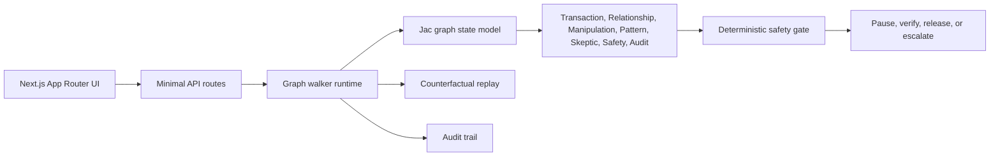

# ScamGraph Sentinel

**Tagline:** Stop the scam before the money moves.

ScamGraph Sentinel is a hackathon-ready demo for detecting authorized-payment scams: situations where the real customer is authenticated but may be socially engineered into sending money to a scammer.

This is a fictional local demo. It does not connect to banks or process money.

## Quick Start

```bash
npm install
npm run dev
```

Open `http://localhost:3000`.

## Test Commands

```bash
npm run test
npm run build
npm run test:e2e
```

## Demo Flow

1. Open `/transfer`.
2. Review the fictional `$4,800` transfer to `Secure Holdings LLC`.
3. Click `Send $4,800`.
4. Answer Yes to the three safety questions.
5. Watch the multi-agent investigation graph expand.
6. Open the intervention page showing `PAUSED — POSSIBLE BANK IMPERSONATION`.
7. Open replay to change recipient/contact facts and see the result soften.
8. Open audit to inspect walker actions, evidence, policy, and JSON export.

## Architecture



## Why Jac Is Central

The core product is a graph investigation, not a generic dashboard. The canonical Jac model lives in `jac/scamgraph_sentinel.jac` and defines the required node types, edges, and walker responsibilities. The running app mirrors those walkers in `lib/scamgraph/engine.ts` so the demo works reliably in a local Next.js process while preserving the Jac-first architecture.

## Nodes

Customer, Account, Transfer, Recipient, Communication, Claim, Instruction, TransactionSignal, ManipulationSignal, ExculpatorySignal, ScamPattern, AgentFinding, Policy, Intervention, Investigation, AuditEvent.

## Edges

OWNS, INITIATED, SENT_TO, CONTACTED_BY, CLAIMED_TO_BE, INSTRUCTED, EXHIBITS, SUPPORTED_BY, CONTRADICTED_BY, CHALLENGED_BY, MATCHES_PATTERN, TRIGGERED, GOVERNED_BY, RECORDED_AS.

## Walkers

transaction_context_walker, relationship_walker, manipulation_walker, pattern_match_walker, skeptic_walker, safety_gate_walker, audit_walker, replay_walker.

## Transparent Demo Logic

This is transparent hackathon demonstration logic, not a production banking model.

Positive weights include new recipient, amount over 3x normal transfer, caller initiation, bank impersonation, unsafe-account claim, safe-account instruction, secrecy, and urgency. Exculpatory weights include independent verification, established recurring recipient, and customer-initiated payment.

Critical-risk payments cannot be automatically released. A customer override requires specialist review.

## Three-Minute Demo Script

Start on the landing page and say: “ScamGraph Sentinel focuses on authorized-payment scams, where login authentication succeeds but the customer may be manipulated.”

Open the transfer page. “The customer is sending `$4,800` to a new recipient called Secure Holdings LLC for account protection.”

Click send. “Before release, Jac walkers investigate transaction context, recipient relationship, manipulation indicators, innocent explanations, and policy.”

Answer Yes to the three questions. “These answers become graph evidence, not chatbot text.”

Open the intervention. “The result is paused because multiple signals combine into a possible bank-impersonation pattern. The Skeptic Agent searched for legitimate explanations and found no independent relationship.”

Open replay. “Now we change only two facts: this recipient was paid monthly for 18 months, and the customer initiated independently. Only affected branches update and the result changes.”

Open audit. “Every important agent action, evidence item, policy rule, and status transition is recorded.”

## 30-Second Pitch

ScamGraph Sentinel stops authorized-payment scams before money moves. Instead of asking only whether the customer is authenticated, it asks whether the payment reflects independent intent. Jac graph walkers combine transaction context, recipient relationship, manipulation signals, a visible Skeptic Agent, deterministic safety policy, replay, and auditability. The demo pauses a high-risk bank-impersonation transfer respectfully, explains why, and proves through counterfactual replay that it does not block every large payment.

## Known Limitations

- Fictional data only.
- No real bank integrations.
- The local runtime mirrors the Jac walkers in TypeScript for hackathon reliability.
- LLM semantic interpretation is intentionally omitted; all release decisions are deterministic.
- Replay supports the two requested counterfactual facts only.

## Production Next Steps

- Run Jac walkers as the authoritative service runtime.
- Add secure bank-event ingestion and case-management integrations.
- Expand safe customer contact workflows.
- Add human specialist review queues.
- Calibrate thresholds using controlled historical data.
- Add privacy, fairness, security, and model-risk governance reviews.
